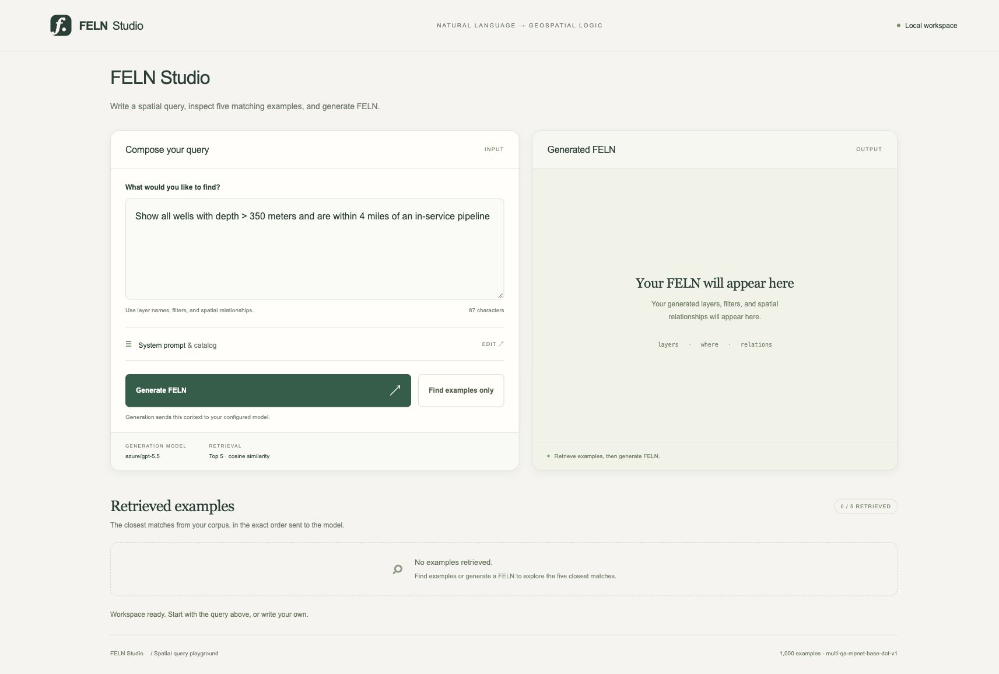
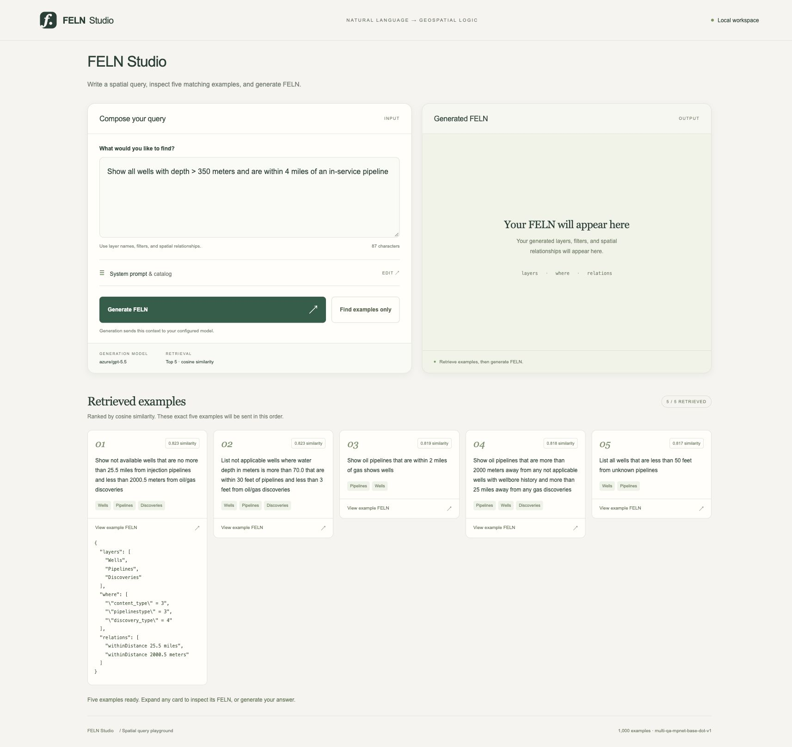

# feln-rag

Generate FELN spatial queries from natural language using retrieved NorthSea examples.
SentenceTransformer embeds the examples, NumPy selects the closest matches, and an LLM
returns JSON validated and scored by `feln`.

## Setup

Requires Python 3.13, `uv`, and sibling checkouts named `../feln`, `../layers-json`, and
`../VectorlessGAIT`. These provide FELN validation/scoring, catalog models, and the optional
vectorless retriever. This project does not depend on `gen-ai-toolkit`.

```bash
uv sync
uv run --no-sync pytest -q
uv run --no-sync pyright feln_rag
```

Dependencies use relative local paths. The layers-json override selects the sibling checkout
instead of the upstream package's Git pin. `uv.lock` is generated locally and ignored because
sibling dependency metadata can contain personal repository URLs. The environment is therefore
not pinned across machines; use matching sibling revisions when reproducing results.

For generation, configure `LLM_MODEL_NAME` and the selected provider's credentials in your
shell or a local `.env`. Never commit credentials. The CLI loads `.env`; library callers must
load it themselves. `--no-sync` uses an already installed environment.

## NorthSea data

The bundled dataset is in [`feln_rag/data/NorthSea`](feln_rag/data/NorthSea):

- `FELN.json`: 1,000 natural-language queries with FELN answers.
- `Layers.json`: five layer definitions, with connection URIs removed.
- `okf/`: NorthSea concept documents for the alternate catalog prompt.

Both CLI entry points default to these bundled files. The OKF documents retain relative
NorthSea source names for context; the referenced geodatabase and ArcGIS project are not
included or needed for retrieval and generation. No local filesystem paths are required.

## FELN Studio

A local single-page app with a query editor, editable system prompt, five ranked examples,
and a copyable FELN result. The UI uses plain HTML, CSS, and JavaScript, served by Python's
standard-library HTTP server; no frontend build step is required.



### Launch and stop

```bash
uv run --no-sync python -m feln_rag.web
```

Open **http://127.0.0.1:8765/**. Keep the terminal running; press **Ctrl+C** to stop the server.
The default encoder is `local:multi-qa-mpnet-base-dot-v1`. Model weights may download on first
use. Override the generation model with `--model`, the encoder with `--encoder`, and the
local port with `--port`.

### Workflow

1. Enter a NorthSea query.
2. Click **Find examples only** to retrieve five examples without an extractor LLM request.
   Each card shows similarity, source text, layer names, and expandable FELN.
3. Optionally expand **System prompt & catalog** to edit the instructions.
4. Click **Generate FELN**. Studio uses the five displayed examples in order, retrieving them
   first if necessary. **Copy JSON** copies the result.

Changing the query clears examples and output. Editing the prompt clears only the output.
**Restore default prompt** restores the catalog instructions. **VALID FELN** indicates schema
validity, not correctness of the model's interpretation. Invalid output remains visible.



These screenshots show the real NorthSea workspace and local retrieval, without a generation
request. Generation sends the query, prompt/catalog, and examples to the configured provider
and may incur charges. Credentials remain server-side. Studio binds to loopback, checks
hosts/origins, and does not persist browser edits or generated output.

Studio uses the full corpus under `indices/playground`. Evaluation uses a separate holdout.

## Evaluation

```bash
# Retrieval quality; no extractor LLM calls.
uv run --no-sync python -m feln_rag.eval retrieval \
  --encoders local:multi-qa-mpnet-base-dot-v1 --holdout 100

# Small live comparison against a zero-shot baseline.
uv run --no-sync python -m feln_rag.eval e2e \
  --encoders local:multi-qa-mpnet-base-dot-v1 none --holdout 10 --limit 3

# Alternate NorthSea catalog prompt.
uv run --no-sync python -m feln_rag.eval e2e \
  --catalog okf --encoders none --holdout 10 --limit 3
```

| Option | Default | Behavior |
|---|---|---|
| `--holdout` | `100` | Must leave at least one training and test example. |
| `--seed` | `0` | Reproducible split shared by retrievers. |
| `--top-k` | `5` | `0` skips retriever setup; negative values are rejected. |
| `--limit` | `0` | E2E queries; `0` uses the full holdout. Use a small limit when iterating. |
| `--cache` | `indices` | Embedding cache directory. |
| `--out` | `out` | E2E results directory. |
| `--model` | `LLM_MODEL_NAME` | Generation and vectorless model. |

Retrievers: `local:<sentence-transformer>`, `litellm:<embedding-model>`, `vectorless`, or
`none`. Vectorless makes LLM requests even in retrieval mode. Omitting `--encoders` runs the
built-in encoder comparison. Local inference is serialized to prevent concurrent device
crashes; retrieval evaluation batches query embeddings. E2E runs up to eight LLM requests
concurrently and records individual request failures without discarding successful results.

## Caches and results

Caches live at `indices/<encoder>/<fingerprint>/{data.json,data.npz}`. The fingerprint includes
the exact encoder name and ordered corpus texts. Current metadata is used on cache hits.
Missing, unreadable, or incorrectly sized vector caches are rebuilt. Delete a model's cache
if its weights or embedding behavior change without a name change. Old caches without a
fingerprint directory are ignored.

E2E writes `out/e2e_<catalog>_<encoder>.jsonl`, replacing the previous file. Rows contain
`text`, `gold`, `pred`, `valid`, `same`, `structural`, `partial`, and `shots`. Failed requests
include `error` and receive zero scores. Results are written after an encoder finishes;
interrupted runs are not checkpointed. Inspect errors before interpreting quality scores.
Caches, results, local environments, and local configuration are ignored by Git.

## NorthSea smoke results

Measured on 2026-09-15 with MPNet retrieval, `azure/gpt-5.5`, seed 0, holdout 10, top-k 5.
Retrieval scored all ten queries; E2E used the first three for each configuration.

| Check | Result |
|---|---|
| Corpus validation | 1,000 examples pass FELN schema validation |
| Retrieval best@5 | 0.666 |
| Layer-set hits@5 | 10/10 |
| RAG exact match | 3/3 |
| Zero-shot exact match | 2/3 |
| Completed LLM requests | 6 valid outputs, no request errors |

The zero-shot miss used `intersects` where gold used `contains`. These small samples test
operation, not general accuracy. The NorthSea UI was checked in Chrome for layout, query
editing, retrieval, and expanded examples.

A warmed local benchmark of 100 queries, median of three runs, measured **1.033 s** for
individual embeddings versus **0.098 s** batched (**10.6× faster**). Vectors agreed within
`atol=1e-5`. This measures embedding time, not total retrieval or generation latency.
