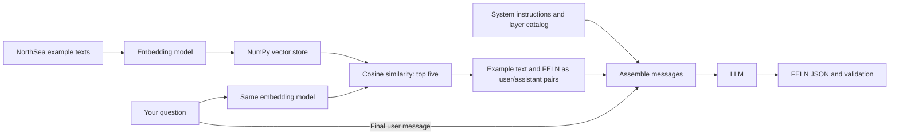

# feln-rag

Ask a question such as “Show oil wells within five kilometers of gas pipelines.” To turn
that into a useful spatial query, a model needs to know the layers, how their fields are
encoded, and how to express the relationship between them. A few relevant examples can
show it how those pieces fit together.

That is the idea behind this project: find NorthSea questions similar to yours, give the
model their FELN answers as worked examples, and then ask it to translate your question.
FELN is the structured JSON output: `layers` identifies the features, `where` supplies their
SQL filters, and `relations` describes the spatial relationships.

Two companion projects supply the foundation:

- [layers-json](https://github.com/mraad/layers-json) supplies the catalog models used to
  describe layer names, fields, coded values, and hints in the system prompt.
- [feln](https://github.com/mraad/feln) supplies the FELN models, output validation, and
  comparison tools used to score generated queries against known answers.

## From a question to FELN

### 1. Give each example a place in the vector store

Each NorthSea example pairs a natural-language question (`text`) with its FELN answer
(`meta`). An embedding model turns the **question text** into a vector: a list of numbers
that represents its meaning. We store those vectors as rows in a NumPy array, keeping each
row linked to its original text and FELN. That array is the vector store.

The vectors are normalized to unit length and cached on disk, so unchanged examples do not
need to be embedded again each time an index is loaded.

### 2. Find questions that sound like yours

Your new question goes through the same embedding model. We compare its vector with every
row in the array and select the five closest matches. Similarity is measured with **cosine
similarity**; because the vectors are normalized, a NumPy dot product gives that score.

Retrieval returns the original question and associated FELN for each match. A high score
means the example is similar enough to be useful context; it does not establish that its
answer is also the answer to your question.

### 3. Show the model a few worked examples, then ask your question

The retrieved pairs become alternating user and assistant messages. Each example question
is a **user** message, and its known FELN answer is the following **assistant** message.
The system instructions and layer catalog come first. Your actual question comes last:

```text
system:    Translation instructions and the NorthSea layer catalog
user:      First retrieved example question
assistant: That example's FELN JSON
user:      Second retrieved example question
assistant: That example's FELN JSON
           …remaining retrieved pairs, in ranked order…
user:      Your question
```

This is few-shot prompting: the model sees examples of the translation we want before
answering the final question. It then generates a new FELN JSON object, which `feln` validates.
The catalog provides the meaning of the data; the examples demonstrate how to use it.
Together they help the model produce the intended query, although schema validation alone
cannot guarantee that it understood the question correctly.



## Setup

Requires Python 3.13, `uv`, and sibling checkouts of [feln](https://github.com/mraad/feln)
at `../feln` and [layers-json](https://github.com/mraad/layers-json) at `../layers-json`.
The current dependency configuration also requires `../VectorlessGAIT` for the optional
vectorless retrieval mode.

```bash
uv sync
uv run --no-sync pytest -q
uv run --no-sync pyright feln_rag
```

Dependencies use relative local paths. The layers-json override selects the sibling checkout
instead of the upstream package's Git pin. `uv.lock` is generated locally and ignored because
sibling dependency metadata can contain personal repository URLs. The environment is therefore
not pinned across machines; use matching sibling revisions when reproducing results.

For generation, configure `LLM_MODEL_NAME` and the selected provider's credentials in your
shell or a local `.env`. Never commit credentials. The CLI loads `.env`; library callers must
load it themselves. `--no-sync` uses an already installed environment.

## NorthSea data

The bundled dataset is in [`feln_rag/data/NorthSea`](feln_rag/data/NorthSea):

- `FELN.json`: 1,000 natural-language queries with FELN answers.
- `Layers.json`: five layer definitions, with connection URIs removed.
- `okf/`: NorthSea concept documents for the alternate catalog prompt.

Both CLI entry points default to these bundled files. The OKF documents retain relative
NorthSea source names for context; the referenced geodatabase and ArcGIS project are not
included or needed for retrieval and generation. No local filesystem paths are required.

## FELN Studio

The local playground moved to [`../feln-studio`](../feln-studio): one SPA over this RAG
pipeline, the feln-lora GGUF and the feln-liquid MLX adapter, with one strict judge. It imports
`feln_rag` (index, prompt, generation) and reads the bundled NorthSea data from this checkout:

```bash
cd ../feln-studio && uv run --no-sync python -m feln_studio.server --backends rag
```

Configure `LLM_MODEL_NAME` and provider credentials in `../feln-studio/.env`. **Find examples
only** inspects retrieval before any provider call; **Generate** sends the five displayed
examples, in order, followed by your question. Generation may incur charges; credentials stay
server-side. UI checks and screenshots live in that repository.

## Evaluation

```bash
# Retrieval quality; no extractor LLM calls.
uv run --no-sync python -m feln_rag.eval retrieval \
  --encoders local:multi-qa-mpnet-base-dot-v1 --holdout 100

# Small live comparison against a zero-shot baseline.
uv run --no-sync python -m feln_rag.eval e2e \
  --encoders local:multi-qa-mpnet-base-dot-v1 none --holdout 10 --limit 3

# Alternate NorthSea catalog prompt.
uv run --no-sync python -m feln_rag.eval e2e \
  --catalog okf --encoders none --holdout 10 --limit 3
```

| Option | Default | Behavior |
|---|---|---|
| `--holdout` | `100` | Must leave at least one training and test example. |
| `--seed` | `0` | Reproducible split shared by retrievers. |
| `--top-k` | `5` | `0` skips retriever setup; negative values are rejected. |
| `--limit` | `0` | E2E queries; `0` uses the full holdout. Use a small limit when iterating. |
| `--cache` | `indices` | Embedding cache directory. |
| `--out` | `out` | E2E results directory. |
| `--model` | `LLM_MODEL_NAME` | Generation and vectorless model. |

Retrievers: `local:<sentence-transformer>`, `litellm:<embedding-model>`, `vectorless`, or
`none`. Vectorless makes LLM requests even in retrieval mode. Omitting `--encoders` runs the
built-in encoder comparison. Local inference is serialized to prevent concurrent device
crashes; retrieval evaluation batches query embeddings. E2E runs up to eight LLM requests
concurrently and records individual request failures without discarding successful results.

## Caches and results

Caches live at `indices/<encoder>/<fingerprint>/{data.json,data.npz}`. The fingerprint includes
the exact encoder name and ordered corpus texts. Current metadata is used on cache hits.
Missing, unreadable, or incorrectly sized vector caches are rebuilt. Delete a model's cache
if its weights or embedding behavior change without a name change. Old caches without a
fingerprint directory are ignored.

E2E writes `out/e2e_<catalog>_<encoder>.jsonl`, replacing the previous file. Rows contain
`text`, `gold`, `pred`, `valid`, `same`, `structural`, `partial`, and `shots`. Failed requests
include `error` and receive zero scores. Results are written after an encoder finishes;
interrupted runs are not checkpointed. Inspect errors before interpreting quality scores.
Caches, results, local environments, and local configuration are ignored by Git.

## NorthSea smoke results

Measured on 2026-09-15 with MPNet retrieval, `azure/gpt-5.5`, seed 0, holdout 10, top-k 5.
Retrieval scored all ten queries; E2E used the first three for each configuration.

| Check | Result |
|---|---|
| Corpus validation | 1,000 examples pass FELN schema validation |
| Retrieval best@5 | 0.666 |
| Layer-set hits@5 | 10/10 |
| RAG exact match | 3/3 |
| Zero-shot exact match | 2/3 |
| Completed LLM requests | 6 valid outputs, no request errors |

The zero-shot miss used `intersects` where gold used `contains`. These small samples test
operation, not general accuracy.

A warmed local benchmark of 100 queries, median of three runs, measured **1.033 s** for
individual embeddings versus **0.098 s** batched (**10.6× faster**). Vectors agreed within
`atol=1e-5`. This measures embedding time, not total retrieval or generation latency.
